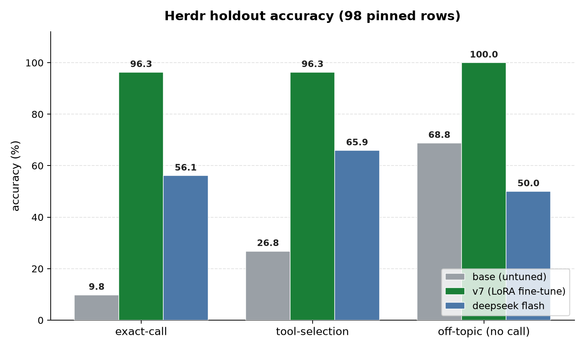

# Herdr expert: LFM2-350M LoRA

Fine-tune **LiquidAI/LFM2-350M** (PEFT LoRA) to be an expert on the **[Herdr](https://herdr.dev)**
terminal multiplexer, so a main agent can ask it in natural language for the
right Herdr operation and run the result.



*A 350M LoRA fine-tune turns a 6.8% base model into a **96.1% expert** on Herdr
tool-calling, on the pinned 120-row holdout (v8). (The frontier-model
comparison — deepseek flash 56.1%, GLM 5.3 flash 73.2% — was scored on the prior
98-row v5 holdout; the v8 frontier run is pending.)*

**Current state:** the tuned adapter is `adapters/lfm2_herdr_lora` (the "v7"
run), published on Hugging Face Hub as **[`agney/lfm2-herdr-lora`](https://huggingface.co/agney/lfm2-herdr-lora)** (weights
are not committed to git; `make fetch` pulls them into `adapters/`). A
**merged GGUF** for llama.cpp is published as
**[`agney/lfm2-herdr-gguf`](https://huggingface.co/agney/lfm2-herdr-gguf)** — the same expert runnable
without Python (see [Run without Python](#run-without-python-gguf--llamacpp));
weights are never committed to git. Current dataset is 804 rows (98 off-topic —
12.2%) across all 25 Herdr ops. The canonical holdout is now
`runs/results/eval_v8_holdout.json` (120 rows, 17 off-topic). See
`runs/results/eval_v8_summary.md` for the v8 run and
`runs/results/eval_v7_summary.md` for prior run history.

---

## Quick start

Load the tuned LoRA adapter and ask one prompt in ~30 seconds:

```python
import torch
from transformers import AutoModelForCausalLM, AutoTokenizer
from peft import PeftModel
from herdr_tools import SCHEMAS                      # the 25 Herdr tool schemas

tok = AutoTokenizer.from_pretrained("LiquidAI/LFM2-350M")
model = AutoModelForCausalLM.from_pretrained(
    "LiquidAI/LFM2-350M", dtype=torch.bfloat16, device_map="auto")
model = PeftModel.from_pretrained(model, "agney/lfm2-herdr-lora").eval()  # weights pulled from https://huggingface.co/agney/lfm2-herdr-lora

prompt = tok.apply_chat_template(
    [{"role": "system", "content":
        "HERDR_ENV=1\nworkspace=w1\ntab=w1:t1\npane=w1:p1\ncwd=/home/repo\nagent kind=hermes"},
     {"role": "user", "content": "split my pane"}],
    tools=SCHEMAS, tokenize=False, add_generation_prompt=True)
ids = tok(prompt, return_tensors="pt").to(model.device)
out = model.generate(**ids, max_new_tokens=192, do_sample=False)
print(tok.decode(out[0][ids.input_ids.shape[1]:], skip_special_tokens=False))
```

The model answers in native `<|tool_call_start|>[name(k=v, ...)]<|tool_call_end|>`
syntax; parse it with `eval_lfm2.parse_calls`. The full planner loop and the
120-row holdout eval live in `eval_lfm2.py` (see [Evaluate](#evaluate)). Training
runs on a Google Colab GPU — see [Training](#training-google-colab).

---

## How it works

The pipeline is three steps:

1. `make_dataset.py` generates `dataset.jsonl` — `{messages, tools, expected}`
   entries covering all 25 Herdr ops, ~12% off-topic including hard negatives
   that reuse Herdr verbs but act outside Herdr. Tail tools get >=10 surface
   forms; contrastive minimal pairs separate confusable ops (list/create
   worktrees, get/install). The tool schemas come from `herdr_tools.py`.
   `messages` are chat-format, ready for
   `tokenizer.apply_chat_template(tools=...)`: on-topic assistant turns keep
   the reasoning line and carry a structured `tool_calls` field, which the
   chat template renders in native
   `<|tool_call_start|>[name(k=v, ...)]<|tool_call_end|>` syntax; off-topic
   rows learn a natural-language refusal. `expected` carries the structured
   tool-call labels for validate/eval.
2. `train_lfm2.py` — PEFT LoRA SFT (loss masked to assistant tokens only),
   saves the best-validation checkpoint (training runs on a Colab GPU — see below).
3. `eval_lfm2.py` — scores against a pinned, query-keyed holdout, reporting raw
   AND normalized exact-call accuracy.

The deterministic split logic lives in `split.py`, the single source of truth:
the eval holdout is carved out first, then train/val are split from the rest,
so the three sets are provably disjoint.

## Files

| File | Purpose |
|------|---------|
| `herdr_tools.py` | The 25 Herdr operations; schemas loaded from `reference/herdr_schemas.json`. |
| `split.py` | Single source of truth for the train/val/eval split (holdout carved out first). |
| `make_dataset.py` | Generates `dataset.jsonl` (chat format + structured labels). |
| `train_lfm2.py` | LoRA SFT driver (run on Colab GPU; see below). |
| `eval_lfm2.py` | Holdout eval; `--base` for baseline. |
| `eval_pi.mjs` | Same holdout via pi's `ModelRuntime` for any catalog model (deepseek flash, GLM 5.3 flash); `--holdout` selects the pin; records tokens + cost. |
| `pin_holdout.py` | Persists the eval holdout (keyed by query) so re-eval stays comparable as the dataset grows. |
| `validate_dataset.py` | Live-validates dataset labels against a real `herdr` server. |
| `adapters/lfm2_herdr_lora/` | **Current tuned adapter (v7).** Weights are not committed to git — published as [`agney/lfm2-herdr-lora`](https://huggingface.co/agney/lfm2-herdr-lora) on Hugging Face Hub; `scripts/fetch_adapter.py` / [`make fetch`](#fetch) pulls them in. Older runs are archived alongside (`_v1`, `_v3`, `_v4`, `_v6`). |
| `reference/` | Herdr tool schemas, captured CLI help (`cli_help/`), API schema, skill doc. |
| `scripts/` | Colab glue (`setup_lfm2_colab.py`, `fix_torchao.py`, `run_detached_*.py`), `fetch_adapter.py` (pulls the tuned adapter from HF Hub), `export_gguf.py` (merge + GGUF export for llama.cpp; `make gguf`), `herdr_gguf.py` (one-command query runner), `eval_gguf.py` (scores a GGUF on the holdout; `make gguf-eval`), one-off probes (`probe_*`), and `make_eval_graph.py` (renders `docs/eval_comparison.*`). |
| `runs/results/` | Durable results: per-version `eval_v*_summary.md`, holdout JSONs, raw `eval_*` outputs, and [`runs/results/caveats.md`](runs/results/caveats.md) (compatibility/caveats doc). Regenerable checkpoints/logs live under `runs/checkpoints/` and `runs/logs/` (gitignored). |
| `NOTES.md` | Why we dropped Needle 2; how to recover that track. |
| `Makefile` | `make data` / `make eval` / `make validate`; `make train` prints the Colab recipe. |

The pipeline chain is: `make data` -> train on Colab -> `make fetch`
(pulls [`agney/lfm2-herdr-lora`](https://huggingface.co/agney/lfm2-herdr-lora) into `adapters/lfm2_herdr_lora/`) -> `make eval`.

## Training (Google Colab)

A T4 is enough for 350M (~15 min). Use the `colab` CLI (or just run
`make train` to print this recipe):

```sh
colab new -s NAME --gpu T4
colab exec -s NAME -f scripts/setup_lfm2_colab.py   # transformers>=4.55 peft accelerate (datasets dropped)
colab exec -s NAME --timeout 400 -f scripts/fix_torchao.py   # torchao>=0.16 (peft 0.20 requires it)
colab upload -s NAME dataset.jsonl /content/dataset.jsonl
colab upload -s NAME train_lfm2.py /content/train_lfm2.py
colab upload -s NAME split.py /content/split.py     # train_lfm2.py imports it
colab upload -s NAME runs/results/eval_v8_holdout.json /content/eval_v8_holdout.json   # optional: pinned holdout
```

Current recipe (v6/v7): epochs 12, batch 1, grad-accum 8, lr 1e-4, LoRA
r=16 alpha=32 on `q/k/v` + `w1/w3/w2`. The Colab scripts write the adapter flat
at `/content/lfm2_herdr_lora`; once trained, `make fetch` (or upload the adapter
to [`agney/lfm2-herdr-lora`](https://huggingface.co/agney/lfm2-herdr-lora)) publishes it so a fresh clone can use it. Train with
`--env HOLDOUT=/content/eval_v8_holdout.json` so the 120 eval rows never leak
into training. The LFM2 target-map gotcha, the Drive-mirror / VM-reap lifecycle,
and the exact `run_detached_dump.py` flow are in
[`runs/results/caveats.md`](runs/results/caveats.md).

## Evaluate

Score the adapter against the pinned, query-keyed holdout (120 rows) so results
stay comparable as the dataset grows:

```sh
.venv/bin/python eval_lfm2.py --adapter adapters/lfm2_herdr_lora --holdout runs/results/eval_v8_holdout.json
.venv/bin/python eval_lfm2.py --base --holdout runs/results/eval_v8_holdout.json   # baseline
```

The holdout is pinned once via `pin_holdout.py` (keyed by query string, so
appending training rows never shifts it) and reused for both eval and train —
how the pin and split stay valid is in [`runs/results/caveats.md`](runs/results/caveats.md).

**Current result (v8)** — 120-row holdout (`runs/results/eval_v8_holdout.json`), seed 42,
strictly disjoint from training, all 25 tools represented:

| model | exact-call | exact-norm | tool-selection | off-topic |
|---|---:|---:|---:|---:|
| base (untuned) | 6.8% | 6.8% | 25.2% | 47.1% (8/17) |
| **v7 adapter** | **96.1% (99/103)** | **96.1%** | **97.1% (100/103)** | **100% (17/17)** |

For comparison, the **prior v7 result on the 98-row holdout** (now history; the
canonical pin moved to v8's 120 rows) was **96.3%**, with the frontier models
scored through `eval_pi.mjs` on that same 98-row holdout:

| model (98-row v5 holdout) | exact-call | exact-norm | tool-selection | off-topic |
|---|---:|---:|---:|---:|
| base (untuned) | 9.8% | 9.8% | 26.8% | 68.8% |
| **v7 (current adapter)** | **96.3% (79/82)** | **96.3%** | **96.3%** | **100% (16/16)** |
| deepseek-v4-flash-vision-exp (pi harness) | 56.1% | 56.1% | 65.9% | 50.0% |
| glm-5.3-flash / OpenRouter (pi harness) | 73.2% | 76.8% | 87.8% | 50.0% |

> **Frontier-model comparison** (`eval_pi.mjs`): deepseek-v4-flash-vision-exp
> and glm-5.3-flash were scored through pi's `ModelRuntime` with the same 25
> Herdr tools on the 98-row v5 holdout. Both trail the fine-tune on exact-call
> (56.1% and 73.2% vs 96.3%) and both act on half the off-topic prompts; those
> runs cost **$0.0069** (deepseek) and **$0.0080** (GLM). The **v8 frontier run
> is pending**. Full breakdowns: `runs/results/eval_deepseek_summary.md`,
> `runs/results/eval_glm_summary.md`.

> **Before comparing runs, read [`runs/results/caveats.md`](runs/results/caveats.md).** v7 is a
> *regime change* (rotated system prompts, context-free grounding) and must not
> be compared head-to-head with v6; every pre-fix number (v1–v4, before commit
> `798b7d8`) scored a *continuation* and is invalid. Per-run numbers and failure
> modes are in `runs/results/eval_v7_summary.md` and `runs/results/eval_v8_summary.md`.

Runtime invariant: `pane_split` without explicit pane/current targets the
caller's pane; normalization makes it explicit (`current: true`). Eval reports
both raw and normalized accuracy.

## Limitations

The honest failure modes on the v7 (98-row) holdout, from `runs/results/eval_v7_summary.md`;
on the v8 120-row holdout the same adapter still scored **96.1% exact** and
**100% off-topic**:

- **"give me a new pane on the right"** — still emits a hallucinated
  `pane_create(Direction=...)` (wrong casing). "give me a new pane"
  paraphrases are thin in training; not fixed since v6.
- **"where am i?" / "please, where am i?"** — under-calls (emits no tool).
  These surface forms are held out and absent from training; `pane_current` has
  ~20 training forms but not these.
- **Two tools are below 100% grounding** — `pane_split` 4/5 and `pane_current`
  1/3 on exact args; the other 16 tools ground at 100%.

Beyond the holdout, `validate_dataset.py` replays against a live `herdr` server.
Its `integration_install` check previously used a stale 4-agent whitelist, which
produced **22 false FAILs** — the installed CLI (v0.8.2) *accepts* those agents
(`herdr integration install --help` lists cursor/copilot/devin/droid/kilo among
its possible values), and the model is trained on valid calls. That check now
validates against the CLI's accepted set. The remaining known validate failure is
1× `worktree_create` with `base='develop'` (the scratch repo has no such branch).

## Run without Python (GGUF / llama.cpp)

The adapter is meant to be loaded in Python, but you can also run the **merged
model** as a [`GGUF`](https://github.com/ggml-org/llama.cpp) — a single binary
(no Python model-loading needed). The published files live on
[`agney/lfm2-herdr-gguf`](https://huggingface.co/agney/lfm2-herdr-gguf):
`lfm2-herdr-f16.gguf` (679 MB), `lfm2-herdr-Q8_0.gguf` (362 MB),
`lfm2-herdr-Q5_K_M.gguf` (249 MB), `lfm2-herdr-Q4_K_M.gguf` (219 MB).

**Easiest path — one command, no hand-built prompt** (builds the system env +
tool list for you, runs llama.cpp, prints the parsed tool call):

```sh
.venv/bin/python scripts/herdr_gguf.py --gguf Q8_0.gguf --query "split my pane" --spawn
```

Or drive it directly with a pre-rendered prompt:

```sh
curl -L -o lfm2-herdr-Q8_0.gguf \
  https://huggingface.co/agney/lfm2-herdr-gguf/resolve/main/lfm2-herdr-Q8_0.gguf
./build/bin/llama-server -m lfm2-herdr-Q8_0.gguf --port 8080 &
curl http://127.0.0.1:8080/completion -d '{"prompt":"<rendered prompt>","n_predict":128,"temperature":0}'
```

The prompt carries the same system env + Herdr tool schemas as the Python
`apply_chat_template(tools=...)` call — the model answers in the native
`<|tool_call_start|>[name(k=v, ...)]<|tool_call_end|>` syntax, parsed by
`eval_lfm2.parse_calls` (or `scripts/herdr_gguf.py`). For an OpenAI-style
`tools=` endpoint, run `llama-server -m lfm2-herdr-Q8_0.gguf --port 8080` and
POST `/v1/chat/completions` with your messages + the 25 `herdr_tools.SCHEMAS`.

**Measured accuracy** (pinned 120-row holdout, `scripts/eval_gguf.py`), vs the
bf16 adapter's 96.1% exact / 100% off-topic:

| GGUF | size | exact-call | off-topic |
|---|---:|---:|---:|
| `lfm2-herdr-f16.gguf` | 679 MB | **96.1%** | 100% |
| `lfm2-herdr-Q8_0.gguf` | 362 MB | **96.1%** | 100% |
| `lfm2-herdr-Q5_K_M.gguf` | 249 MB | 95.1% | 100% |
| `lfm2-herdr-Q4_K_M.gguf` | 219 MB | 92.2% | 100% |

F16/Q8_0 are **lossless** (merge + GGUF conversion changes nothing vs bf16);
Q4_K_M costs ~4 pts, mostly the `pane_current`/`pane_split` arg rows the bf16
model already stumbles on. A 350M GGUF runs on a plain laptop CPU (~50 tok/s
at Q4_K_M) — no GPU, no Python environment. `make gguf` reproduces the export
from the adapter (`scripts/export_gguf.py`), `make gguf-push` uploads it, and
`make gguf-eval` scores a GGUF against the holdout (`scripts/eval_gguf.py`,
needs `llama-server`).

> **Caveat:** GGUF is a *storage* format — you still need the `llama.cpp`
> binaries (`llama-cli` / `llama-server`) to run it. It removes the Python
> *model-loading* layer, not the inference harness; the run/eval scripts fill in
> the prompt + parse so end users don't hand-format it.

This is a **narrow specialist**, not a general model: it plans the 25 Herdr ops
and refuses off-topic prompts; it does not do general chat, code, or reasoning.

## Safety notes

- Eval is side-effect free; it only compares predicted calls to labels.
- Do not close workspaces/tabs/panes/sessions you did not create, and never
  `herdr server stop` from an active session unless intended.
- Command syntax follows the installed `herdr` CLI (v0.8.2), captured under
  `cli_help/` — the installed CLI is the source of truth.

---

## License

Released under the [MIT License](LICENSE) — free to use, modify, and
redistribute for any purpose, including commercial use and distillation. See
the `LICENSE` file for the full text.
